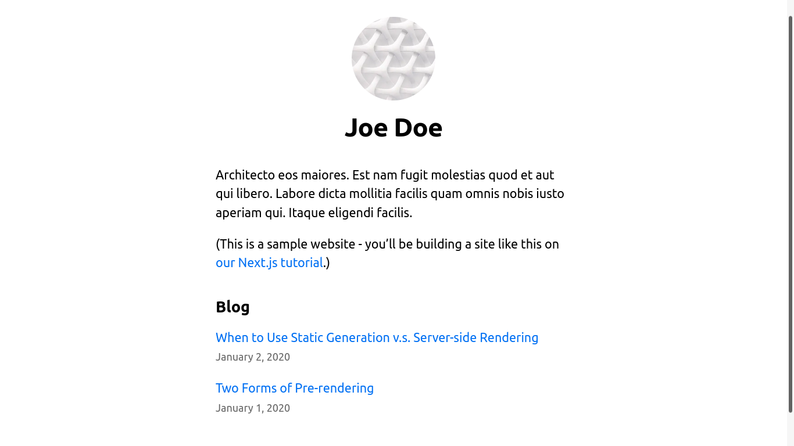

<h1 align="center">
    
</h1>

<h1 align="center">   
💻 <a href="#"> Next JS Blog </a>
</h1>

<h3 align="center">
Sample blog developed with next js
</h3>

<p align="center">
  

  

  <a href="https://github.com/arubesu/nextjs-blog/commits/master">
    
  </a>
    
    
   
</p>


<p align="center">
 <a href="#about">About</a> •
 <a href="#layout">Layout</a> • 
 <a href="#pre-requisites">Pre requisites</a> • 
 <a href="#tech-stack">Tech Stack</a> • 
 <a href="#author">Author</a> • 
 <a href="#license">License</a>

</p>


## About

 Next Js blog - is a sample blog developed by me following the  [Next JS Learn ](https://nextjs.org/learn) Page.

---

## Layout

<p align="center" style="display: flex; align-items: flex-start; justify-content: center;">
 

---
## Pre-requisites

Before you begin, you will need to have the following tools installed on your machine:
[Git] (https://git-scm.com), [Node.js] (https://nodejs.org/en/).
In addition, it is good to have an editor to work with the code like [VSCode] (https://code.visualstudio.com/)


#### Running the web application 

```bash

# Clone this repository 

$ git clone git@github.com:arubesu/nextjs-blog.git

# Access the project folder cmd/terminal
$ cd nextjs-blog

# Install the dependencies
$ npm install

# Run the application 
$ npm run dev

# The application will open on the port: 3000 - go to http://localhost:3000

```
---
## Tech Stack

The following tools were used in the construction of the project:

#### **Website**  ([React](https://reactjs.org/))
   
-   **[NEXT js](https://nextjs.org/)**

> See the file  [package.json](https://github.com/arubesu/nextjs-blog/blob/main/package.json)

---
## How to contribute

1. Fork the project.
2. Create a new branch with your changes: `git checkout -b my-feature`
3. Save your changes and create a commit message telling you what you did: `git commit -m" feature: My new feature "`
4. Submit your changes: `git push origin my-feature`
> If you have any questions check this [guide on how to contribute](https://github.com/firstcontributions/first-contributions)

---

## Author

 
 <br />

 [](https://www.linkedin.com/in/bruno-a-souza/) 
---

## License

This project is under the license [MIT](./LICENSE.md).

Made with ❤️  by Bruno Souza 👋🏽 [Get in Touch!](https://www.linkedin.com/in/bruno-a-souza/)
